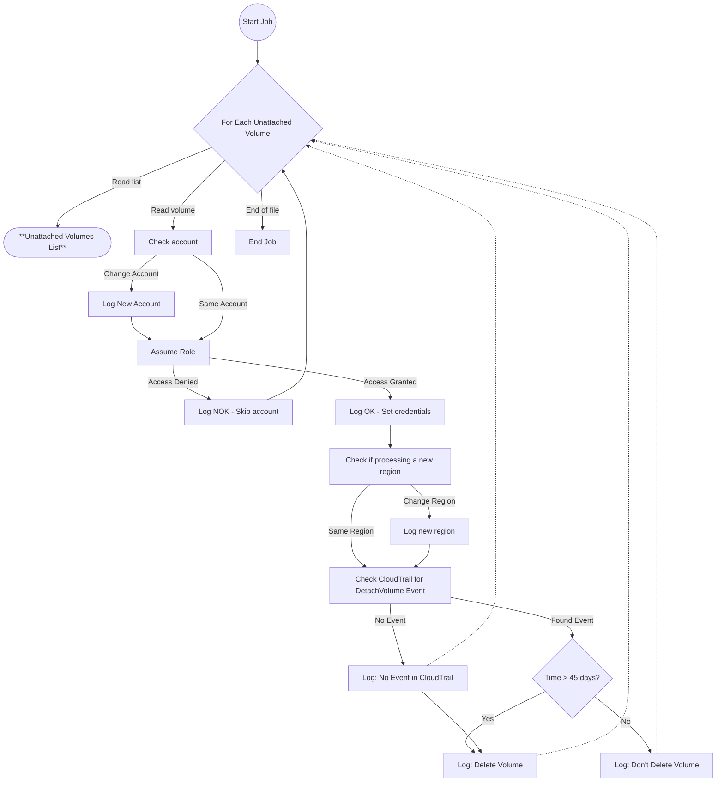

# Delete EBS Volumes Unattached for More Than 45 Days

The repository contains the code to delete all the EBS volumes unattached for more than 45 days.

This is useful for an environment with multiple AWS accounts with multiple volumes on different regions.

## The Tool

This bash script will read a CSV file generated by the repository https://github.com/becatini/ebs-volumes_unattached.

Essentially, it will access CloudTrail and look for events that indicate when the volume was unattached.

If the volume was unattached for more than 45 days, or there is no event, the unattached volume will be deleted. 

## Diagram

